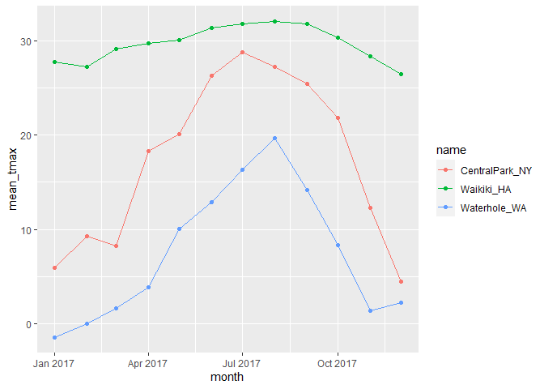
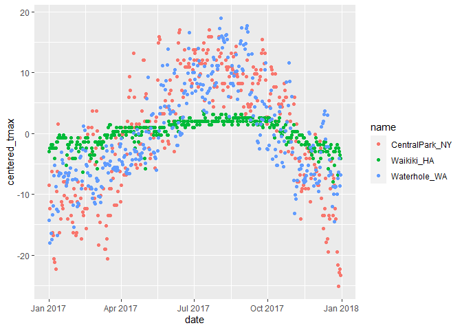

eda
================
Justin Vargas

## Let’s import data

``` r
library(tidyverse)
```

    ## ── Attaching packages ─────────────────────────────────────── tidyverse 1.3.2 ──
    ## ✔ ggplot2 3.3.6      ✔ purrr   0.3.4 
    ## ✔ tibble  3.1.8      ✔ dplyr   1.0.10
    ## ✔ tidyr   1.2.1      ✔ stringr 1.4.1 
    ## ✔ readr   2.1.2      ✔ forcats 0.5.2 
    ## ── Conflicts ────────────────────────────────────────── tidyverse_conflicts() ──
    ## ✖ dplyr::filter() masks stats::filter()
    ## ✖ dplyr::lag()    masks stats::lag()

This code from the course website gets the data.

``` r
weather_df = 
  rnoaa::meteo_pull_monitors(
    c("USW00094728", "USC00519397", "USS0023B17S"),
    var = c("PRCP", "TMIN", "TMAX"), 
    date_min = "2017-01-01",
    date_max = "2017-12-31") %>%
  mutate(
    name = recode(
      id, 
      USW00094728 = "CentralPark_NY", 
      USC00519397 = "Waikiki_HA",
      USS0023B17S = "Waterhole_WA"),
    tmin = tmin / 10,
    tmax = tmax / 10,
    month = lubridate::floor_date(date, unit = "month")) %>%
  select(name, id, everything())
```

    ## Registered S3 method overwritten by 'hoardr':
    ##   method           from
    ##   print.cache_info httr

    ## using cached file: C:\Users\Justin\AppData\Local/Cache/R/noaa_ghcnd/USW00094728.dly

    ## date created (size, mb): 2022-09-18 13:28:32 (8.418)

    ## file min/max dates: 1869-01-01 / 2022-09-30

    ## using cached file: C:\Users\Justin\AppData\Local/Cache/R/noaa_ghcnd/USC00519397.dly

    ## date created (size, mb): 2022-09-18 13:28:42 (1.701)

    ## file min/max dates: 1965-01-01 / 2020-02-29

    ## using cached file: C:\Users\Justin\AppData\Local/Cache/R/noaa_ghcnd/USS0023B17S.dly

    ## date created (size, mb): 2022-09-18 13:28:46 (0.952)

    ## file min/max dates: 1999-09-01 / 2022-09-30

## `group_by()`

``` r
weather_df %>% 
  group_by(name, month)
```

    ## # A tibble: 1,095 × 7
    ## # Groups:   name, month [36]
    ##    name           id          date        prcp  tmax  tmin month     
    ##    <chr>          <chr>       <date>     <dbl> <dbl> <dbl> <date>    
    ##  1 CentralPark_NY USW00094728 2017-01-01     0   8.9   4.4 2017-01-01
    ##  2 CentralPark_NY USW00094728 2017-01-02    53   5     2.8 2017-01-01
    ##  3 CentralPark_NY USW00094728 2017-01-03   147   6.1   3.9 2017-01-01
    ##  4 CentralPark_NY USW00094728 2017-01-04     0  11.1   1.1 2017-01-01
    ##  5 CentralPark_NY USW00094728 2017-01-05     0   1.1  -2.7 2017-01-01
    ##  6 CentralPark_NY USW00094728 2017-01-06    13   0.6  -3.8 2017-01-01
    ##  7 CentralPark_NY USW00094728 2017-01-07    81  -3.2  -6.6 2017-01-01
    ##  8 CentralPark_NY USW00094728 2017-01-08     0  -3.8  -8.8 2017-01-01
    ##  9 CentralPark_NY USW00094728 2017-01-09     0  -4.9  -9.9 2017-01-01
    ## 10 CentralPark_NY USW00094728 2017-01-10     0   7.8  -6   2017-01-01
    ## # … with 1,085 more rows

## `summarize()`

let’s group and then summarize!

``` r
weather_df %>% 
  group_by(name, month) %>% 
  summarize(
    n_obs = n()
  )
```

    ## `summarise()` has grouped output by 'name'. You can override using the
    ## `.groups` argument.

    ## # A tibble: 36 × 3
    ## # Groups:   name [3]
    ##    name           month      n_obs
    ##    <chr>          <date>     <int>
    ##  1 CentralPark_NY 2017-01-01    31
    ##  2 CentralPark_NY 2017-02-01    28
    ##  3 CentralPark_NY 2017-03-01    31
    ##  4 CentralPark_NY 2017-04-01    30
    ##  5 CentralPark_NY 2017-05-01    31
    ##  6 CentralPark_NY 2017-06-01    30
    ##  7 CentralPark_NY 2017-07-01    31
    ##  8 CentralPark_NY 2017-08-01    31
    ##  9 CentralPark_NY 2017-09-01    30
    ## 10 CentralPark_NY 2017-10-01    31
    ## # … with 26 more rows

can we count in other ways?

``` r
weather_df %>% 
  count(name, month)
```

    ## # A tibble: 36 × 3
    ##    name           month          n
    ##    <chr>          <date>     <int>
    ##  1 CentralPark_NY 2017-01-01    31
    ##  2 CentralPark_NY 2017-02-01    28
    ##  3 CentralPark_NY 2017-03-01    31
    ##  4 CentralPark_NY 2017-04-01    30
    ##  5 CentralPark_NY 2017-05-01    31
    ##  6 CentralPark_NY 2017-06-01    30
    ##  7 CentralPark_NY 2017-07-01    31
    ##  8 CentralPark_NY 2017-08-01    31
    ##  9 CentralPark_NY 2017-09-01    30
    ## 10 CentralPark_NY 2017-10-01    31
    ## # … with 26 more rows

don’t use `table()`

``` r
weather_df %>% 
  pull(month) %>% 
  table()
```

you can have multiple summaries

``` r
weather_df %>% 
  group_by(month) %>% 
  summarize(
    n_obs = n(),
    n_dist = n_distinct(date)
  )
```

    ## # A tibble: 12 × 3
    ##    month      n_obs n_dist
    ##    <date>     <int>  <int>
    ##  1 2017-01-01    93     31
    ##  2 2017-02-01    84     28
    ##  3 2017-03-01    93     31
    ##  4 2017-04-01    90     30
    ##  5 2017-05-01    93     31
    ##  6 2017-06-01    90     30
    ##  7 2017-07-01    93     31
    ##  8 2017-08-01    93     31
    ##  9 2017-09-01    90     30
    ## 10 2017-10-01    93     31
    ## 11 2017-11-01    90     30
    ## 12 2017-12-01    93     31

## a brief aside on 2x2 tables

``` r
weather_df %>% 
  mutate(
    cold = case_when(
      tmax <  5 ~ "cold",
      tmax >= 5 ~ "not_cold",
      TRUE      ~ ""
  )) %>% 
  filter(name != "Waikiki_HA") %>% 
  group_by(name, cold) %>% 
  summarize(
    n_obs = n()
  ) %>% 
  pivot_wider(
    names_from = cold,
    values_from = n_obs
  )
```

    ## `summarise()` has grouped output by 'name'. You can override using the
    ## `.groups` argument.

    ## # A tibble: 2 × 3
    ## # Groups:   name [2]
    ##   name            cold not_cold
    ##   <chr>          <int>    <int>
    ## 1 CentralPark_NY    44      321
    ## 2 Waterhole_WA     172      193

``` r
weather_df %>% 
  mutate(
    cold = case_when(
      tmax <  5 ~ "cold",
      tmax >= 5 ~ "not_cold",
      TRUE      ~ ""
  )) %>% 
  filter(name != "Waikiki_HA") %>% 
  janitor::tabyl(name, cold)
```

    ##            name cold not_cold
    ##  CentralPark_NY   44      321
    ##    Waterhole_WA  172      193

## General summaries

``` r
weather_df %>% 
  group_by(name, month) %>% 
  summarize(
    n_obs = n(), 
    mean_tmax = mean(tmax, na.rm = TRUE), 
    sd_prcp = sd(prcp), 
    median_tmax = median(tmax, na.rm = TRUE)
  )
```

    ## `summarise()` has grouped output by 'name'. You can override using the
    ## `.groups` argument.

    ## # A tibble: 36 × 6
    ## # Groups:   name [3]
    ##    name           month      n_obs mean_tmax sd_prcp median_tmax
    ##    <chr>          <date>     <int>     <dbl>   <dbl>       <dbl>
    ##  1 CentralPark_NY 2017-01-01    31      5.98    79.0         6.1
    ##  2 CentralPark_NY 2017-02-01    28      9.28    63.9         8.3
    ##  3 CentralPark_NY 2017-03-01    31      8.22   114.          8.3
    ##  4 CentralPark_NY 2017-04-01    30     18.3     74.7        18.3
    ##  5 CentralPark_NY 2017-05-01    31     20.1    155.         19.4
    ##  6 CentralPark_NY 2017-06-01    30     26.3    103.         27.2
    ##  7 CentralPark_NY 2017-07-01    31     28.7     91.0        29.4
    ##  8 CentralPark_NY 2017-08-01    31     27.2     56.9        27.2
    ##  9 CentralPark_NY 2017-09-01    30     25.4     45.4        26.1
    ## 10 CentralPark_NY 2017-10-01    31     21.8    138.         22.2
    ## # … with 26 more rows

``` r
weather_df %>% 
  group_by(name, month) %>% 
  summarize(across(prcp:tmin, mean))
```

    ## `summarise()` has grouped output by 'name'. You can override using the
    ## `.groups` argument.

    ## # A tibble: 36 × 5
    ## # Groups:   name [3]
    ##    name           month       prcp  tmax   tmin
    ##    <chr>          <date>     <dbl> <dbl>  <dbl>
    ##  1 CentralPark_NY 2017-01-01  39.5  5.98  0.748
    ##  2 CentralPark_NY 2017-02-01  22.5  9.28  1.45 
    ##  3 CentralPark_NY 2017-03-01  43.0  8.22 -0.177
    ##  4 CentralPark_NY 2017-04-01  32.5 18.3   9.66 
    ##  5 CentralPark_NY 2017-05-01  52.3 20.1  12.2  
    ##  6 CentralPark_NY 2017-06-01  40.4 26.3  18.2  
    ##  7 CentralPark_NY 2017-07-01  34.3 28.7  21.0  
    ##  8 CentralPark_NY 2017-08-01  27.4 27.2  19.5  
    ##  9 CentralPark_NY 2017-09-01  17.0 25.4  17.4  
    ## 10 CentralPark_NY 2017-10-01  34.3 21.8  13.9  
    ## # … with 26 more rows

This is a dataframe!!!

``` r
weather_df %>% 
  group_by(name, month) %>% 
  summarize(
    mean_tmax = mean(tmax, na.rm = TRUE)
  ) %>% 
  ggplot(aes(x = month, y = mean_tmax, color = name)) + 
  geom_point() + 
  geom_path()
```

    ## `summarise()` has grouped output by 'name'. You can override using the
    ## `.groups` argument.

<!-- -->

``` r
weather_df %>% 
  group_by(name, month) %>% 
  summarize(
    mean_tmax = mean(tmax, na.rm = TRUE)
  ) %>% 
  pivot_wider(
    names_from = name,
    values_from = mean_tmax
  ) %>% 
  knitr::kable(digit = 2)
```

    ## `summarise()` has grouped output by 'name'. You can override using the
    ## `.groups` argument.

| month      | CentralPark_NY | Waikiki_HA | Waterhole_WA |
|:-----------|---------------:|-----------:|-------------:|
| 2017-01-01 |           5.98 |      27.76 |        -1.40 |
| 2017-02-01 |           9.28 |      27.22 |        -0.02 |
| 2017-03-01 |           8.22 |      29.08 |         1.67 |
| 2017-04-01 |          18.27 |      29.71 |         3.87 |
| 2017-05-01 |          20.09 |      30.11 |        10.10 |
| 2017-06-01 |          26.26 |      31.31 |        12.87 |
| 2017-07-01 |          28.74 |      31.76 |        16.33 |
| 2017-08-01 |          27.19 |      32.02 |        19.65 |
| 2017-09-01 |          25.43 |      31.74 |        14.16 |
| 2017-10-01 |          21.79 |      30.29 |         8.31 |
| 2017-11-01 |          12.29 |      28.38 |         1.38 |
| 2017-12-01 |           4.47 |      26.46 |         2.21 |

## Grouped mutates

``` r
weather_df %>% 
  group_by(name) %>% 
  mutate(
    mean_tmax = mean(tmax, na.rm = TRUE),
    centered_tmax = tmax - mean_tmax) %>% 
  ggplot(aes(x = date, y = centered_tmax, color = name)) + 
  geom_point()
```

    ## Warning: Removed 3 rows containing missing values (geom_point).

<!-- -->

lagged observations

``` r
weather_df %>% 
  group_by(name) %>% 
  mutate(
    yesterday_tmax = lag(tmax), 
    tmax_change = tmax - yesterday_tmax
  ) %>% 
  summarize(
    sd_tmax_change = sd(tmax_change, na.rm = TRUE)
  )
```

    ## # A tibble: 3 × 2
    ##   name           sd_tmax_change
    ##   <chr>                   <dbl>
    ## 1 CentralPark_NY           4.45
    ## 2 Waikiki_HA               1.23
    ## 3 Waterhole_WA             3.13

One other window function …

``` r
weather_df %>% 
  group_by(name, month) %>% 
  mutate(
    tmax_rank = min_rank(tmax)
  ) %>% 
  filter(tmax_rank < 4) %>% 
  arrange(name, month, tmax_rank)
```

    ## # A tibble: 128 × 8
    ## # Groups:   name, month [36]
    ##    name           id          date        prcp  tmax  tmin month      tmax_rank
    ##    <chr>          <chr>       <date>     <dbl> <dbl> <dbl> <date>         <int>
    ##  1 CentralPark_NY USW00094728 2017-01-09     0  -4.9  -9.9 2017-01-01         1
    ##  2 CentralPark_NY USW00094728 2017-01-08     0  -3.8  -8.8 2017-01-01         2
    ##  3 CentralPark_NY USW00094728 2017-01-07    81  -3.2  -6.6 2017-01-01         3
    ##  4 CentralPark_NY USW00094728 2017-02-10     0   0    -7.1 2017-02-01         1
    ##  5 CentralPark_NY USW00094728 2017-02-03     0   0.6  -3.2 2017-02-01         2
    ##  6 CentralPark_NY USW00094728 2017-02-04     0   1.1  -5.5 2017-02-01         3
    ##  7 CentralPark_NY USW00094728 2017-03-15     0  -3.2  -6.6 2017-03-01         1
    ##  8 CentralPark_NY USW00094728 2017-03-11     0  -1.6  -8.2 2017-03-01         2
    ##  9 CentralPark_NY USW00094728 2017-03-12     0  -1.6  -7.1 2017-03-01         2
    ## 10 CentralPark_NY USW00094728 2017-04-01     0   8.9   2.8 2017-04-01         1
    ## # … with 118 more rows
